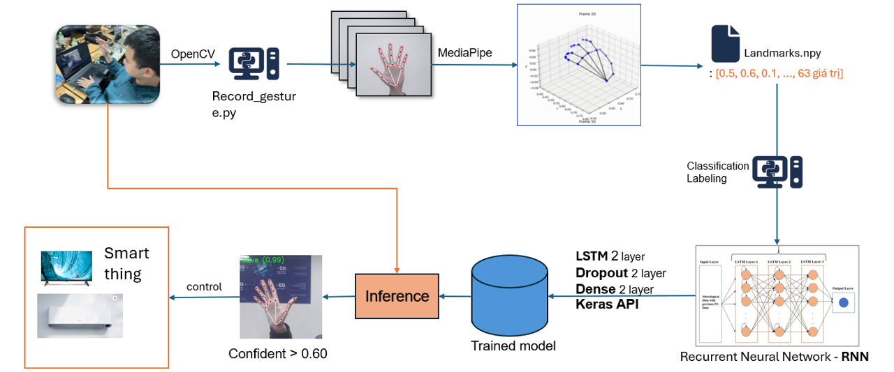

<p align="center">
  
  
</p>

# Dynamic Hand Gesture Recognition Using MediaPipe and LSTM

## Poster

<p align="center">
  
</p>

## Architecture  

<p align="center">
  
</p>

This project implements dynamic hand gesture recognition using MediaPipe for hand landmark detection and an LSTM neural network for gesture classification. The repository contains the following files:

- `Inference.py`: Script for real-time hand gesture recognition using a pre-trained LSTM model.
- `record_gesture.py`: Script for recording hand gesture videos and corresponding landmarks for training.
- `training_model.ipynb`: Jupyter notebook for training the LSTM model with recorded gesture landmarks.

## Installation

1. Clone the repository:
   ```sh
   git clone https://github.com/khuong-d4ng/Dynamic_Hand_Gesture_Using_MediaPipe_LSTM_By_Group_1_CNTT1605.git
   cd Dynamic_Hand_Gesture_Using_MediaPipe_LSTM_By_Group_1_CNTT1605
   ```

2. Install the required dependencies:
   ```sh
   pip install -r requirements.txt
   ```

## Usage

### Recording Gestures
The `record_gesture.py` script allows you to record hand gesture videos and save the corresponding landmarks.

1. Run the script:
   ```sh
   python record_gesture.py
   ```

2. Follow the prompts to enter the gesture name and starting number for the recordings.
3. Press 'r' to start recording, 's' to stop recording, and 'q' to quit.

### Training the Model
The `training_model.ipynb` notebook is used to train the LSTM model with the recorded gesture landmarks.

1. Ensure that the recorded landmarks are saved in the appropriate directory.
2. Open the Jupyter notebook:
   ```sh
   jupyter notebook training_model.ipynb
   ```
3. Follow the steps in the notebook to load the data, train the model, and save the trained model.

### Real-Time Gesture Recognition
The `Inference.py` script uses the trained LSTM model to recognize hand gestures in real-time.

1. Ensure the trained model (`model.h5`) is in the same directory as the script.
2. Run the script:
   ```sh
   python Inference.py
   ```
3. The script will use your webcam to detect hand gestures and display the recognized gesture on the screen.

## File Descriptions

### Inference.py
This script performs real-time hand gesture recognition using a webcam feed. It utilizes MediaPipe for hand landmark detection and an LSTM model for gesture classification.

### record_gesture.py
This script records hand gestures and saves both the video and the corresponding hand landmarks. It allows you to record multiple gestures and save them in a structured directory format.

### training_model.ipynb
This Jupyter notebook loads the recorded gesture landmarks, preprocesses the data, and trains an LSTM model for gesture recognition. The trained model is then saved for use in the inference script.

## Dependencies
- Python 3.6+
- OpenCV
- MediaPipe
- TensorFlow
- NumPy
- Jupyter

You can install the dependencies using the following command:
```sh
pip install -r requirements.txt
```

## License
© 2025 NHÓM 1, CNTT16-02, TRƯỜNG ĐẠI HỌC ĐẠI NAM

## Acknowledgements
This project uses the following libraries:
- [MediaPipe](https://mediapipe.dev/)
- [OpenCV](https://opencv.org/)
- [TensorFlow](https://www.tensorflow.org/) <br>

This initiative was directed by those exceptional individuals:
- ThS. Le Trung Hieu
- ThS. Tran Thai Khanh

For any questions or issues, please open an issue in the repository.
